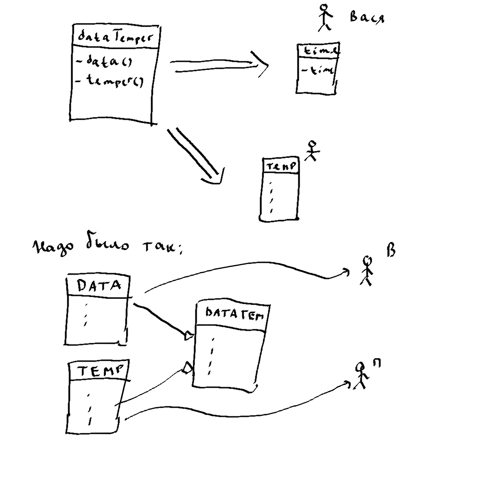

## Проблемы дублирования кода
Влияющая на сложность:
```java
if (x * x - 2 * x > 5 - x) {
	System.out.println(x * x - 2 * x);
} else {
   	System.out.println(5 - x);
}

// Лучше так
int a = x * x - 2 * x;
int b = 5 - x;
int max = a > b ? a : b;
```
Не влияющая на сложность:
```java
// n!! (1*3*5) если n нечет (2*4*6) если n чет
// типичное решение:
int n = 1;
if (n % 2 == 0) {
    int p = 1;
    for (int i = 2; i < n; i+= 2) {
        p *= i;
    }
} else {
    int p = 1;
    for (int i = 1; i < n; i += 2) {
        p *= 1;
    }
}

// Как правильнее:
int p = 1;
for (int i = 2 - n % 2; i <= n; i += 2) {
    p *= i;
}

// Или так:
int p = 1;
while (n >= 1) {
    p *= n;
    n -= 2;
}

```
Дублирование абсолютно одинакового кода - решается занесением под один цикл!

## 1
```java
class Player {
	int hp;
	String name;
	String battleCry;

	// Что-то вроде параметров по умолчанию
	Player(String name) {
		this(name, "Lerroy Jenkins");
	}

	Player(String name, String battleCry) {
		hp = 100;
		this.name = name;
		this.battleCry = battleCry;
	}
}
```
## 2
```java
public class OOP2 {

	public void printA(int n) {
		System.out.println("A");
	}

	public static void main(String[] args) {
		printA(10); // Нельзя !
	}
}

// либо так
public class OOP2 {
	public static void printA(int n) {
		System.out.println("A");
	}

	public static void main(String[] args) {
		printA(10); // Нельзя !
	}
}


// либо так
public class OOP2 {

	public void printA(int n) {
		System.out.println("A");
	}

	public static void main(String[] args) {
		OOP2 x = new OOP2();
		x.printA(10); 
	}
}
```

### Если final class то от него нельзя наследоваться
### Если final у метода, то его нельзя переопределять в потомках

## 3
- Класс `Phone`, метод `call`
- Класс `SmartPhone` наследует `Phone`, переопределенный метод `call`, метод `takePhoto()`
```java
class Human {
	public void callWith(Phone p) {
		p.call();
	}
}

SmartPhone p = new SmartPhone();
Human h = new Human();
h.callWith(p);
```
- p.call() - сработает
- p.takePhoto() - нет

### Восходящее преобразование 
- Сужение интерфейса потомка до интерфейса родителя
- `Phone` p = new `SmartPhone()`;

## SOLID
### 1. разделение ответственности
У каждого ПО есть такая вещь как ось изменений - то есть те поля, методы, функции, которые постоянно меняются.
Если вы работаете на проекте, то вы с легкостью можете назвать эти классы, ф-ии и тд которые постоянно меняются.
Говорят, что ось изменений проходит через вот эти классы, ф-ии и тд. Принцип SRP говорит, что через ваш класс
проходит только одна ось изменеий. То есть ваш класс должен содержать поля и методы, относящиеся к одному вопросу.
Пример: Мы написали класс DataTemperature, у которого есть методы для работы со временем и температурой. К нам 
приходит Вася и говорит: "Мне нужно написать класс для работы со временем, можешь дать свой класс?". Мы отвечаем,
что в нашем классе есть и методы для измер-ия температуры. И Вася вырезает только то, что ему нужно. Теперь к нам 
приходит Петя и просит то же самое только ему нужно написать класс для изм-ия температуры. Он тоже вырезает некоторые
поля и методы. Затем мы отдаем тестировщикам класс, они находят кучу багов, мы их фиксим, но наши изменения не попадут
в классы Пети и Васи. А в их классах могут быть и ошибки, которые они собственноручно сделали. Правильно было написать
два разных класса: Data и Temperature. И создать DataTemperature который наследовался от этих двух.
</br>
 

### 2. классы открыты для расширения и закрыты для модификации
```java
// 2005
interface UserContacts {
	String getEmail();
	String getPhoneNumber();
}
// 2007
class User implements UserContacts {
	String getEmail() {...}
	String getPhoneNumber() {...}
}
// 2010
interface UserContacts {
	String getEmail();
	String getPhoneNumber();
	String getVKURL();
}
``` 
Скомиплированный в .class класс User (2007 год): у меня нет метода getVKURL()
### 3. Принцип подстановки Барбары Лисков
Замена в коде экземляров классов на экземпляры их подклассов (наследников) не должна влиять на правильность работы программы. **По простому**: Ф-ии, которые используют ссылки на базовые, должны иметь возможность использовать объекты подклассов, не зная об этом. То есть наследник не должен сужать возможности родителя.
```java
import java.util.*;

// Пример нарушение принципа Барбары Лисков


abstract class Shape {
	int height;
	int width;
	public abstract int square();
}

class Rectangle extends Shape {
	
	public void setWidth(int width) {
		this.width = width;
	}

	public void setHeight(int height) {
		this.height = height;
	}

	public int square() {
		return this.height * this.width;
	}
}

class Square extends Shape {
	
	public void setSide(int side) {
		this.height = side;
		this.width = side;
	}

	public int square() {
		return this.height * this.height;
	}
}

public class Liskov {
	public static void main(String[] args) {
		Rectangle rect = new Rectangle();
		rect.setWidth(10);
		rect.setHeight(4);
		System.out.println(rect.square());
	}
}

// из этого примера делаем вывод, что в меняя Rectangle на Square мы не добъемся
// желаемого результата а следовательно не можем использовать квадрат как наследник
// прямоугольника не меняя клиентский код
```
### 4. Принцип разделения интерфейса
Много интерфейсов, предназначенных для разных пользователей ( других классов ) лучше одного большого интерфейса, в который свален весь функционал.
```java
interface ISmartPhone {
	void call();
	void sendMessage();
	void makePhoto();
}
// домашний телефон
class LandPhone implements ISmartPhone {
	void call() {...} // реализовали
	void sendMessage() {} // домашний телефон не умеет отправлять смс
	void makePhoto() {} // и делать фотографии тоже не умеет
}
```
Как правильно
```java
interface ICall {
	void call();
}

interface ISendMessage {
	void sendMessage();
}

interface IMakePhoto {
	void makePhoto();
}

interface ISmartPhone extends ICall, ISendMessage, IMakePhoto {}

// домашний тел
class LandPhone implements ICall {
	void call() {...}
}
```
## Yet another "I" ;)
**interface segregation principle**
Клиенты не должны зависеть от методов, которые они не используют.

Принцип разделения интерфейсов говорит о том,
что слишком «толстые» интерфейсы необходимо разделять
на более маленькие и специфические, чтобы клиенты маленьких
интерфейсов знали только о методах, которые необходимы им в работе. В итоге, при изменении метода интерфейса не должны меняться клиенты, которые этот метод не используют.
```java
interface Shapable {
	public int area(); // площадь
	public int volume(); // объем
}

class Square implements Shapable {
	public int area() {
		// height * width
	}

	public int volume() {
		// нельзя найти объем у квадрата
	}
}

class Cuboid implements Shapable {
	public int area() {
		// вычисление площади пов-ти
	}

	public int volume() {
		// объем
	}
}

// метод volume в square и есть нарушение принципа. Класс зависит
// от метода

interface IArea {
	public int area(); // площадь
}

interface IVolume {
	public int volume(); // объем
}

class Square implements IArea {
	public int area() {
		// height * width
	}

	// теперь не зависит
}

class Cuboid implements IArea, IVolume {
	public int area() {
		// вычисление площади пов-ти
	}

	public int volume() {
		// объем
	}
}
```
### 5. Принцип инверсии зависимости 
Зависимости классов должны опираться на абстракции. Зависимости не должны опираться на конкретную реализацию. `Программируйте на уровне интерфейсов`